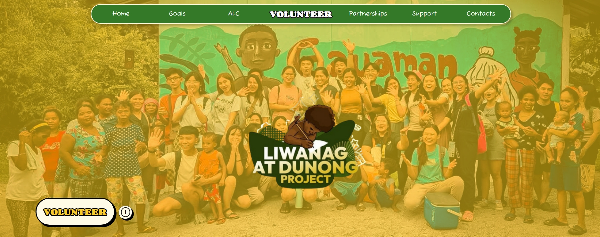
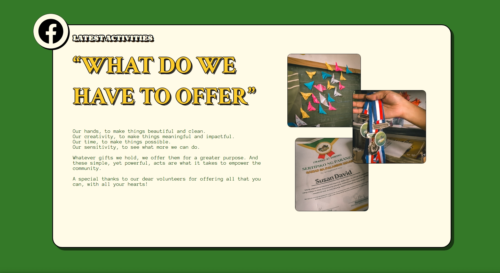
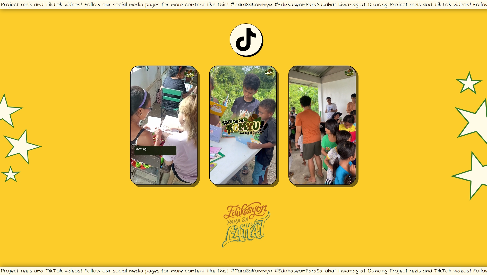
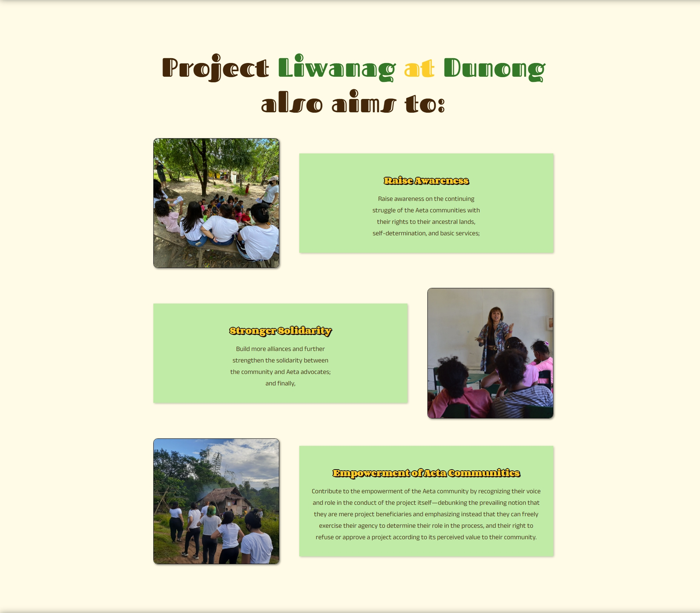
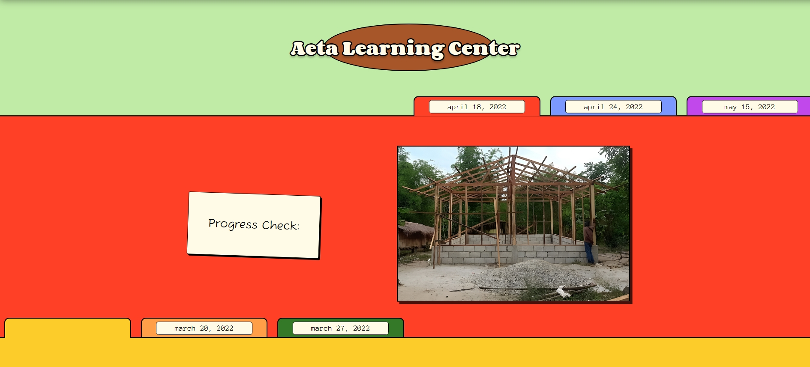
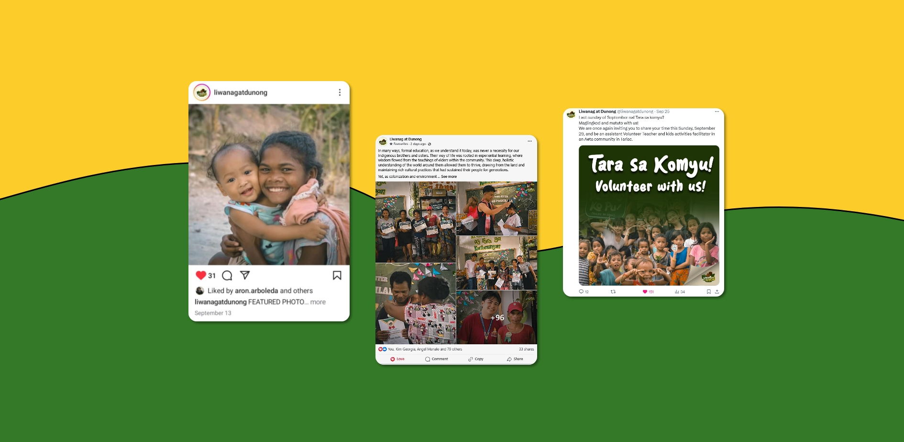
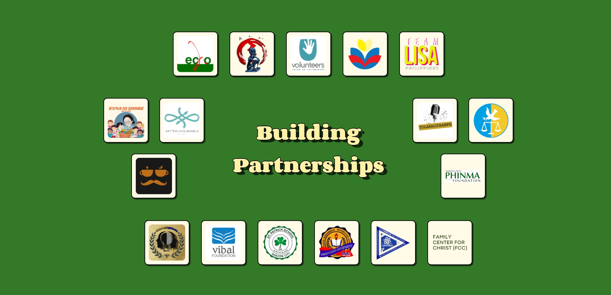
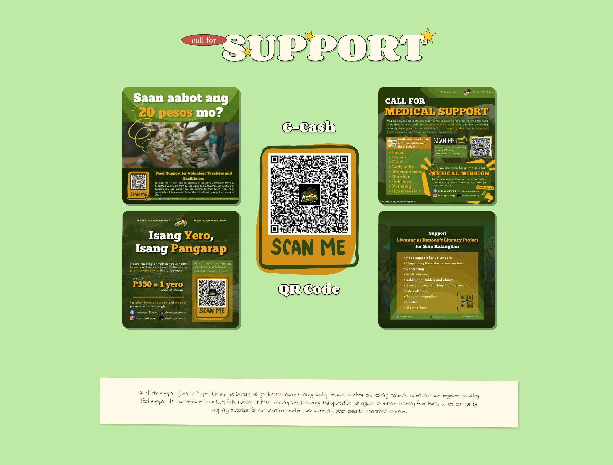
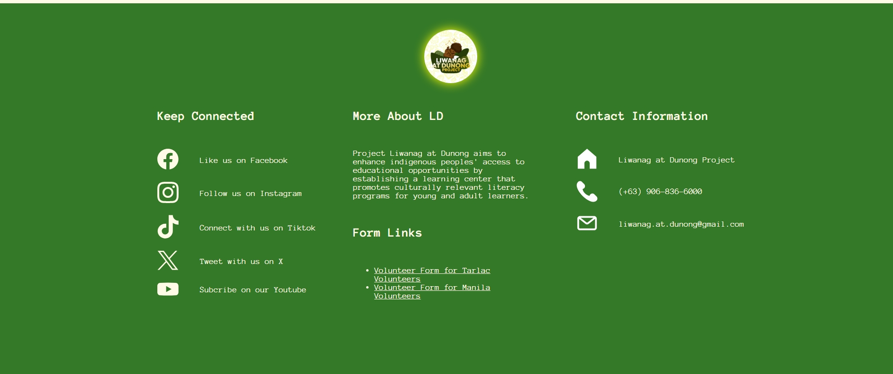

# Liwanag at Dunong Project

  

## Landing Page for Liwanag at Dunong Project

Liwanag at Dunong is a non-governmental organization that seeks to uplift the Aeta Indigenous People. We hope to raise and support the Aetas by providing education, development of skills, and cultural preservation efforts, ensuring their voices are heard and their rights are acknowledged. Help us by unifying in this effort as we provide sustainable opportunities and encourage Aeta self-determination to grow more.

## Instructions

### To access the website

- Go to the link --> (under construction)

## Features still in development

- Custom Domain
- Adding subpages
- Form feature (Database management)
- Data analytics

## LD Dev Team

Front-end Designer:

- [Alex](https://www.instagram.com/lexsusicat)

Developer:

- [Aron](https://github.com/Aron-Arboleda)

Documentation:

- [Jenny](https://www.instagram.com/jentiglao_)
- [Kim](https://www.facebook.com/itsmefantasma)
- [Hetio](https://www.facebook.com/carlohetio)

## Images

  

  
  

  
  

  
  

  
  

 &copy; 2024 Aron-Arboleda. All rights reserved.
