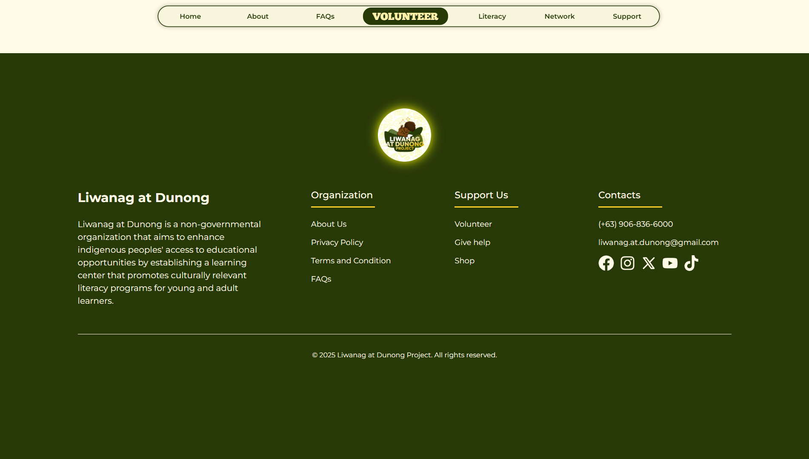

# Liwanag at Dunong Project Website

  

## Landing Page for Liwanag at Dunong Project

A landing page website for the non-governmental organization "Liwanag at Dunong". It contains all of its information such as the History, Volunteering Activities and Events, ways on how to contribute, contacts, etc. The official website (https://liwanagatdunongproject.ct.ws/) contains all the necessary information about the organization and its initiatives.

## Info

- **Project Started:** Nov. 2024
- **Developer:** [Aron-Arboleda](https://github.com/Aron-Arboleda)
- **License:** [LICENSE](LICENSE)

## Instructions

### To access the website

- Go to the link --> https://liwanagatdunongproject.ct.ws/

## Key Features

- **Comprehensive Information:** The website serves as a central hub for all information regarding Liwanag at Dunong, including its mission, vision, activities, and ways to get involved.
- **Interactive UI:** Engaging user interface to provide a seamless experience for visitors.
- **Volunteer Opportunities:** Dedicated section for individuals to learn about and apply for volunteer roles.
- **Donation Support:** Clear pathways for those who wish to support the organization financially.
- **Admin Page:** For staff to handle Volunteer Submissions and manage site content.

## Future Features

- Setting up web sockets
- Better SEO
- Blogs
- Volunteers tracking

## Tech Stack

- **Frontend:** React, Vite, JavaScript, HTML, CSS
- **Backend:** PHP
- **Database:** MySQL
- **Deployment:** InfinityFree

## LD Dev Team

Developer:

- [Aron](https://github.com/Aron-Arboleda)

Front-end Designer:

- [Alex](https://www.instagram.com/lexsusicat)

Documentation:

- [Jenny](https://www.instagram.com/jentiglao_)
- [Kim](https://www.facebook.com/itsmefantasma)
- [Hetio](https://www.facebook.com/carlohetio)

## Images

  

  
  

  
  

 &copy; 2025 Liwanag at Dunong. All rights reserved.
